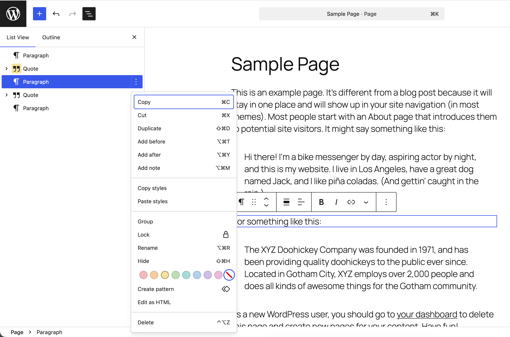

# Sidebar Colors

A focused WordPress plugin for color controls in the block editor sidebar.



## What it does

Sidebar Colors adds a small color palette to each block's options menu and displays the
selected color on that block's icon in List View. Colors are saved with the content as
editorial metadata and do not change the published page's design.

Colors also flow down through nested blocks. Color a Group, Cover, Columns, or another
container block to identify the whole section at a glance, while still allowing individual
blocks inside it to use their own colors.

## Example workflows

- Mark the block you're working on in orange and completed blocks in green to help yourself
  or other authors follow the page's progress.
- Use red for copy that needs review, yellow for content awaiting approval, and green for
  content that is ready to publish.
- Give each large page section a different color so it is easier to find and navigate in
  List View.
- Color parent blocks to show which sections belong to different authors, teams, or stages
  of an editorial workflow.
- Flag blocks that still need links, images, accessibility checks, or other finishing work
  without adding notes to the visible page.

## Requirements

- WordPress 6.7 or newer
- PHP 8.2 or newer

## Installation

1. Download `sidebar-colors-*.zip` from the assets on the
   [latest release](https://github.com/xavortm/sidebar-colors/releases/latest). Do not use
   GitHub's automatically generated source archives.
2. In WordPress, go to **Plugins > Add New Plugin > Upload Plugin**.
3. Select the downloaded ZIP, then choose **Install Now** and **Activate Plugin**.
4. Open the block editor and use the color swatches at the bottom of a block's options menu.

## Development requirements

- Node.js 24
- pnpm 10.28.2
- Composer 2

## Development

```sh
composer install
corepack enable
pnpm install
pnpm start
```

Run `pnpm build` for a production build and `pnpm lint` to check PHP and TypeScript.

## Releases

GitHub Actions validates every pull request and push to `main`. Pushing a semantic version
tag that matches both the plugin header and `package.json` creates a GitHub release with an
installable plugin ZIP:

```sh
git tag v0.1.0
git push origin v0.1.0
```

Run `pnpm release:build` to create the same ZIP locally in `build/`.

## Theme colors

Themes can replace the default palette through `theme.json`:

```json
{
  "settings": {
    "custom": {
      "sidebarColors": {
        "colors": ["#d63638", "#3858e9"]
      }
    }
  }
}
```

The array replaces the defaults completely. Three- and six-digit hexadecimal colors are supported.
